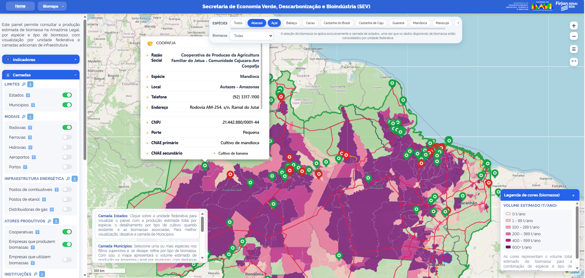
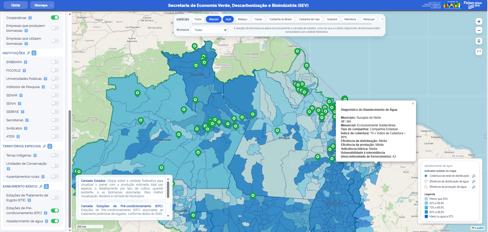

# Vivian Mattos | Data Scientist & AI Engineer 

Cientista de Dados, Engenheira Química e Mestre em Engenharia, com experiência
no desenvolvimento de plataformas inteligentes, pipelines de dados e soluções
digitais de ponta a ponta.

Atuo com **LLMs, RAG, NLP, embeddings, busca semântica, Machine Learning,
análise geoespacial, APIs e aplicações orientadas a dados**, abrangendo desde
a estruturação dos dados e definição da arquitetura até o desenvolvimento,
integração, testes e implantação das soluções.

## 🧠 Especialidades técnicas

* Arquitetura de aplicações com Inteligência Artificial
* Large Language Models — LLMs
* Retrieval-Augmented Generation — RAG
* Processamento de Linguagem Natural — NLP
* Embeddings e busca semântica
* Bancos de dados vetoriais
* Machine Learning e modelagem preditiva
* Pipelines de coleta, processamento e integração de dados
* Análise de patentes e inteligência tecnológica
* Inteligência territorial e análise geoespacial
* APIs, dashboards e aplicações web
* Produtos digitais aplicados a projetos de PD&I

## 🛠️ Stack tecnológica

### Linguagens

`Python` `SQL` `JavaScript` `HTML` `CSS`

### Data Science e Machine Learning

`Pandas` `NumPy` `Scikit-learn` `Matplotlib` `Sentence Transformers`
`Modelagem estatística` `Classificação` `Clusterização` `NLP`

### Inteligência Artificial

`LLMs` `RAG` `Embeddings` `Busca semântica` `Prompt Engineering`
`LangChain` `OpenAI API` `Ollama` `Vector Databases`

### Back-end e aplicações

`Flask` `REST APIs` `Streamlit` `Dash` `Node.js`

### Dados e visualização

`Power BI` `Leaflet` `GeoJSON` `Dashboards interativos`
`Análise exploratória` `Data Storytelling`

### Geoprocessamento

`QGIS` `ArcGIS` `GeoPandas` `Leaflet` `Análise espacial`

### Engenharia e infraestrutura

`Git` `GitHub` `Docker` `GCP` `Microsoft Azure`
`Ambientes virtuais` `Integração de APIs` `ETL`

## 🏗️ Tipos de soluções desenvolvidas

* Plataformas de inteligência territorial
* Sistemas de análise e recuperação de documentos
* Aplicações com busca semântica e bancos vetoriais
* Pipelines de análise de patentes utilizando NLP
* Radares tecnológicos apoiados por Inteligência Artificial
* Dashboards estratégicos e operacionais
* Mapas interativos com múltiplas camadas geoespaciais
* APIs para automação de coleta e processamento de dados
* Sistemas de apoio à decisão orientados por dados

## 🚀 Projetos em destaque

Nesta seção, apresento algumas soluções que representam minha atuação prática em **Ciência de Dados, Inteligência Artificial, análise geoespacial e desenvolvimento de plataformas orientadas a dados**.

Os projetos envolvem diferentes etapas do ciclo de desenvolvimento, incluindo levantamento de requisitos, integração e tratamento de dados, definição da arquitetura, desenvolvimento de funcionalidades, construção de visualizações e disponibilização das soluções.

---

### 🗺️ BioMapa — Plataforma de Inteligência Territorial

O BioMapa é um dos principais projetos da minha trajetória, reunindo **engenharia de dados, geoprocessamento, desenvolvimento web e inteligência territorial** em uma única plataforma.

A solução foi desenvolvida no contexto da FIRJAN SENAI para o Ministério do Desenvolvimento, Indústria, Comércio e Serviços — MDIC.

O sistema integra dados geoespaciais, ambientais, econômicos, produtivos e institucionais para apoiar análises estratégicas relacionadas à bioeconomia e ao desenvolvimento sustentável na Amazônia Legal.

#### Principais componentes técnicos

- Integração de bases de dados heterogêneas;
- Tratamento, padronização e estruturação de dados geoespaciais;
- Mapas interativos com múltiplas camadas temáticas;
- Filtros, indicadores e visualizações estratégicas;
- Arquitetura web baseada em Python, Flask e JavaScript;
- Organização de dados para análises territoriais;
- Estrutura preparada para evolução da plataforma com recursos de Inteligência Artificial.

  

  <em>Interface principal da plataforma, com visualização territorial e camadas temáticas.</em>

  

  <em>Visualização geoespacial utilizada para análise de dados produtivos, ambientais e institucionais.</em>

## 🔬 Inteligência tecnológica e análise de patentes

Desenvolvo pipelines para processamento de documentos técnicos e patentários utilizando:

* extração e tratamento de dados;
* classificação semântica;
* embeddings de textos;
* similaridade vetorial;
* identificação de tecnologias, aplicações e organizações;
* integração com APIs e bases de patentes;
* geração estruturada de informações com LLMs;
* construção de roadmaps e dashboards tecnológicos.

Exemplo de fluxo:

`Coleta de dados → Tratamento → NLP → Embeddings → Busca semântica → LLM → API → Dashboard`

## ⚙️ Abordagem de desenvolvimento

Minha atuação normalmente percorre as seguintes etapas:

1. Levantamento do problema e dos requisitos
2. Identificação e avaliação das fontes de dados
3. Coleta, integração e tratamento dos dados
4. Definição da arquitetura da solução
5. Desenvolvimento dos pipelines de processamento
6. Integração de modelos de Machine Learning ou Inteligência Artificial
7. Desenvolvimento de APIs, interfaces e visualizações
8. Testes, validação e documentação
9. Implantação e evolução da solução

## 🧪 Projetos de PD&I

Possuo experiência em projetos de Pesquisa, Desenvolvimento e Inovação, trabalhando com soluções em diferentes níveis de maturidade tecnológica.

Minha atuação inclui projetos que evoluem desde etapas iniciais de desenvolvimento e prova de conceito até integração, validação e preparação para aplicação em ambiente operacional.

Essa experiência combina:

* pesquisa aplicada;
* desenvolvimento experimental;
* engenharia de dados;
* Inteligência Artificial;
* arquitetura de sistemas;
* construção de produtos digitais;
* comunicação técnica com equipes multidisciplinares.

## 🎓 Formação

* Mestre em Engenharia Metalúrgica e de Materiais — COPPE/UFRJ
* Pós-graduação em Ciência de Dados e Analytics — PUC-Rio
* Graduação em Engenharia Química
* Pós-graduação em Engenharia Ambiental
* Pós-graduação em Auditoria e Perícia Ambiental

## 📌 Repositórios em destaque

Os projetos públicos deste perfil apresentam versões demonstrativas, estudos técnicos e aplicações desenvolvidas com dados públicos ou sintéticos.

* Radar tecnológico com IA
* Pipeline de análise semântica de patentes
* Plataforma de inteligência territorial
* Aplicação de RAG para documentos técnicos
* Dashboard geoespacial interativo
* Projeto completo de Machine Learning

## 📫 Contato

[LinkedIn](https://www.linkedin.com/in/vivian-mattos-b79b32261)
[E-mail](mailto:mattosvivian122@gmail.com)
